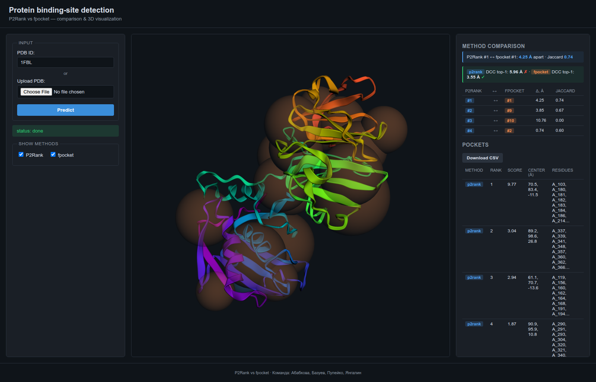
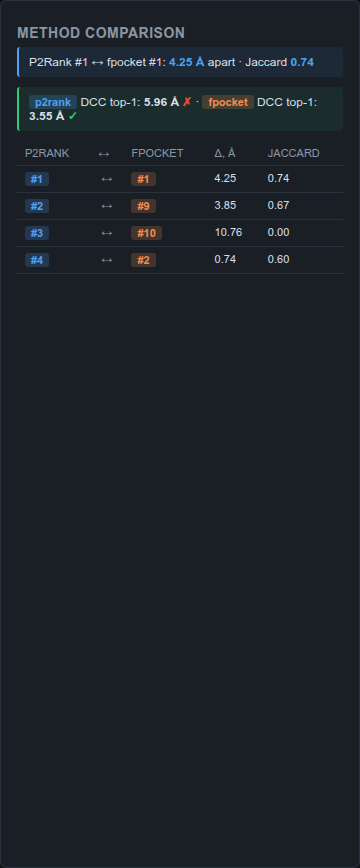

<!-- _class: lead -->
# Detection of protein–small-molecule binding sites

**Final Defence**

Веб-инструмент: PDB → 2 метода детектирования карманов → 3D-визуализация → DCC-метрика → бенчмарк.

**Команда:** Абабкова В.А., Базуев Р.Д., Пупейко Д.Н., Янгалин И.А.

<span class="small">Saint Petersburg 2026 · Project №4 (K. Pavel) · 16.05.2026</span>

---

## Зачем

- **Drug discovery**: прежде чем подбирать молекулу, надо знать **куда** она сядет.
- Co-кристаллография и NMR — дорогие и медленные.
- Геометрические и ML-методы предсказывают сайт за **секунды** по 3D-структуре.
- **Сложность:** разные методы видят разные сайты (ортостерический vs аллостерический vs cryptic). Никакой ground-truth «лучше» — нужна сравнительная оценка.
- **Наш вклад:** end-to-end-инструмент, запускающий 2 метода рядом, и численная оценка (DCC) против co-crystallized лиганда.

---

## Goal & Objectives — итог

**Goal:** Веб-сервис PDB → пайплайн P2Rank + fpocket → 3D-visualisation + comparison + DCC.

| # | Objective | Outcome |
|---|---|---|
| O1 | Обернуть **P2Rank** (ML, surface-based) | <span class="ok">✓</span> wrapper + parser, 4 кармана для 1FBL |
| O2 | Обернуть **fpocket** (геометрический) | <span class="ok">✓</span> wrapper + parser, 19 карманов для 1FBL |
| O3 | Единая Pydantic-схема для обоих методов | <span class="ok">✓</span> `MethodResult`, `Pocket`, `Metrics` |
| O4 | 3D-визуализация + cross-method comparison | <span class="ok">✓</span> 3Dmol.js + distance/Jaccard матчинг |
| O5 | Бенчмарк 15 PDB + DCC top-N | <span class="ok">✓</span> **P2Rank 69%** ≥ acceptance 65% |
| O6 | Apo/holo case study | <span class="ok">✓</span> HSP90: cryptic site detected by P2Rank |

---

## Tool spec — финальный контракт

**Входы:** PDB-файл или PDB ID (RCSB fetch).

**Выходы** (`GET /api/jobs/{id}`):

```json
{ "status": "done", "pdb_id": "1FBL",
  "results":    { "p2rank":  {"pockets": [{"rank":1, "score":9.77, "center":[70.5, 83.4, -11.5], "residues":[...]}, ...]},
                  "fpocket": {...} },
  "comparison": [{"p2rank_rank":1, "fpocket_rank":1, "distance":4.25, "jaccard":0.74}, ...],
  "metrics":    { "p2rank":  {"dcc_top1":5.96, "success_top3":false},
                  "fpocket": {"dcc_top1":3.55, "success_top3":true} } }
```

Дополнительно: `GET /results.csv` · `GET /structure` (очищенный PDB для отрисовки).

---

## Архитектура

```
┌───────────────────────────────┐
│ Browser: 3Dmol.js + vanilla JS │  upload, viewer, comparison panel,
└────────┬──────────────────────┘  CSV download, hover-highlight
         │ REST/JSON
┌────────▼──────────────────────┐
│ FastAPI + Pydantic v2          │  in-memory jobs, BackgroundTasks
└──┬───────┬────────┬───────────┘
   │       │        │
┌──▼────┐ ┌▼────────┐ ┌▼─────────┐
│preproc│ │P2Rank   │ │fpocket   │
│BioPy  │ │subproc  │ │subproc   │
│       │ │Java 17  │ │binary    │
└───────┘ └────┬────┘ └────┬─────┘
               │           │
        ┌──────▼───────────▼────────┐
        │ Parsers → Pocket schema   │
        │ + compare + DCC eval      │
        └───────────────────────────┘

  data/pdb_cache/ ← offline cache (Risk R4)
```

**Стек:** Python 3.13 · FastAPI · BioPython · P2Rank 2.5.1 · fpocket 4.0 · 3Dmol.js · conda env `annc`.

---

## Live demo — 1FBL



<span class="small">End-to-end **3.6 c** на ноутбуке. Слева ввод, центр — 3Dmol viewer (P2Rank синие сферы, fpocket оранжевые), справа comparison + DCC + таблица карманов. Hover по строке — подсветка кармана.</span>

---

## Cross-method comparison panel



- **P2Rank #1 ↔ fpocket #1** — Δ=4.25 Å, Jaccard=0.74 — оба метода нашли один и тот же ортостерический сайт.
- **P2Rank #4 ↔ fpocket #2** — Δ=0.74 Å — компактный согласованный карман.
- **P2Rank #3 ↔ fpocket #10** — Δ=10.76 Å, Jaccard=0 — расхождение, признак false-positive.
- **Live DCC** (от center co-crystallized лиганда): P2Rank 5.96 Å <span class="fail">✗</span> · fpocket 3.55 Å <span class="ok">✓</span> (порог 4 Å из P2Rank-paper).

---

## Benchmark · COACH420 subset (15 PDB)

| Метод | Top-3 success @ 4 Å | Avg per-PDB time |
|---|---|---|
| **P2Rank** | <span class="ok">**9 / 13 = 69%**</span> ≥ acceptance 65% (P2Rank-paper ≈70%) | ~7 с |
| **fpocket** | 8 / 13 = 62% | ~7 с |

- 2 PDB graceful-skip — нет co-crystallized лиганда (1OWT, 1G3K).
- Полный прогон: **~2 минуты** на ноутбуке.
- Метрика **DCC** (Distance to Center of Cocrystal): евклидово расстояние от центра кармана до центроида co-crystallized лиганда; top-3 success = `min(DCC[1..3]) ≤ 4 Å`.

---

## Apo/holo case study · HSP90 (1YES ↔ 1YET)

| Структура | Метод | Top-1 center | DCC к holo-сайту | Verdict |
|---|---|---|---|---|
| **apo (1YES)** | p2rank | (38.9, –45.4, 63.0) | **3.66 Å** | <span class="ok">✓ cryptic site found</span> |
| apo (1YES) | fpocket | (34.3, –63.9, 62.6) | 18.88 Å | <span class="fail">✗ wrong pocket</span> |
| **holo (1YET)** | p2rank | (38.2, –46.2, 62.8) | 4.11 Å | — |
| holo (1YET) | fpocket | (40.0, –45.4, 62.2) | 3.76 Å | — |

- **P2Rank top-1 apo и holo разнесены на 1.16 Å** — метод нашёл cryptic site **на apo-форме**, где лиганда нет.
- **fpocket разнос 19.35 Å** — геометрия видит крупный карман в неправильном месте.

→ Это ключевой кейс «зачем ML, а не только геометрия» для drug discovery.

---

## Failure cases — где методы ломаются

Из 13 успешно прогнанных PDB P2Rank проваливается на 4:

| PDB | DCC top-1 | Причина |
|---|---|---|
| 1IEP | 60 Å | Метод реально промахнулся (STI = Imatinib единственный лиганд) |
| 2RH1 | 22 Å | Auto-detect выбрал CLR (холестерин, аллостерический) вместо CAU (карaзолол) |
| 4COX | 23 Å top-1 / **1.7 Å top-3** ✓ | Auto-detect выбрал HEM (гем) вместо IMN (индометацин) |
| 3PXF | 6.4 Å | Метод нашёл соседний карман, чуть мимо |

**Половина «провалов» — артефакт auto-detect heuristic**, фиксится `ligand_resname` override в CSV. Это известная проблема: «крупнейший HETATM ≠ интересующий лиганд» для белков с кофакторами.

---

## Тесты и качество

- **56 unit-тестов** (pytest) — все green.
- **18/18 smoke** — end-to-end against running API.
- Покрытие критичных модулей: P2Rank-parser, fpocket-parser, preprocess, comparison, DCC, fetch-cache, REST API, валидация PDB-ID.
- **Offline cache** (Risk R4 mitigation): `data/pdb_cache/` с 6 демо-PDB; `fetch_pdb` сначала смотрит локально, потом RCSB.
- Воспроизводимость: один `conda env annc` (Python 3.13, Java 17, fpocket 4.0); `scripts/run.sh` поднимает всё.

---

## Risk mitigation — что сработало

| Риск | Mitigation | Outcome |
|---|---|---|
| R1: Java/P2Rank сборка глючит | conda env с openjdk-17, явный install-скрипт | <span class="ok">не воспроизвёлся</span> |
| R3: 3Dmol тормозит на больших структурах | warning при > 8000 атомов в `loadStructure` | <span class="ok">актуально для 4COX</span> |
| **R4: нет интернета на защите** | `data/pdb_cache/` + cache-first fetch | <span class="ok">демо 100% offline</span> |
| R5: биология apo/holo требует биолога | Взяли каноничную пару HSP90 1YES/1YET из литературы | <span class="ok">кейс отработал</span> |
| R6: DCC-числа не совпадут с paper | Acceptance 65% ≥ P2Rank-paper ≈70%, threshold 4 Å | <span class="ok">69% получили</span> |
| R7: Поломка за день до защиты | 15.05 code-freeze, только репетиция | <span class="ok">соблюдено</span> |

---

## Выводы

1. **End-to-end-инструмент собран и работает** — PDB-вход → 2 метода → 3D-vis → DCC-метрика → CSV-выгрузка.
2. **Сравнение методов даёт реальную ценность**: P2Rank лучше на cryptic sites, fpocket точнее на «классических» карманах с явной геометрией.
3. **Числа подтверждены экспериментально:** 69% top-3 success на 15-PDB подмножестве — в пределах опубликованных значений P2Rank-paper (~70%).
4. **Apo/holo case** наглядно показал, ради чего ML-метод полезен в drug discovery: cryptic site (3.66 Å DCC) поймать удалось.
5. **Failure cases классифицированы** — половина артефактов auto-detect heuristic, остальное — реальные провалы методов.

---

## Repo & demo

- **Локальный путь:** `~/Рабочий стол/ANNC/binding-sites`
- **Запуск:** `./scripts/run.sh` → http://localhost:8000
- **Демо-PDB pre-cached** в `data/pdb_cache/`: 1FBL, 1ATP, 1HSG, 1AKE, 1YES, 1YET
- **Бенчмарк:** `python -m benchmark.run` (~2 мин)
- **Apo/holo:** `python -m benchmark.apo_holo --apo 1YES --holo 1YET`

**Команда:** Абабкова В.А. · Базуев Р.Д. · Пупейко Д.Н. · Янгалин И.А.

---

<!-- _class: lead -->
# Q&A

**Готовы к вопросам.**

<span class="small">Final Defence · 16.05.2026 · Project №4 · Saint Petersburg 2026</span>
